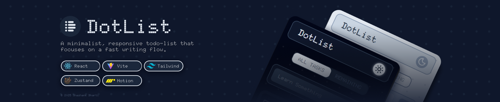

# DotList

DotList is a minimalist, responsive todo list that focuses on a fast writing flow, snappy animations, and a distraction‑free UI. It ships with dark mode, keyboard-friendly input, and a segmented filter so you can jump between every task and your remaining work.

## Tech Stack

- React 18 + Vite (fast dev server and builds)
- Zustand for shared state (`todos`, filter mode, theme) with localStorage persistence
- Tailwind CSS with class-based dark mode
- `lucide-react` icon set for lightweight SVG icons
- `motion/react` (Framer Motion) for button micro-interactions

## Features

- ✅ Add new todos via keyboard (Enter) or the add button
- ✅ Edit inline with save/cancel guard rails
- ✅ Toggle completion and instantly move tasks between lists
- ✅ Delete tasks with animated icon buttons
- ✅ Filter between **All Tasks** and **Remaining** via a segmented control (available in header + mobile body)
- ✅ Light / Dark theme toggle persisted across sessions
- ✅ Responsive layout: desktop header with controls, mobile-friendly stack with floating filter
- ✅ State persisted to `localStorage` so your tasks survive page reloads

## Project Structure

```
src/
	App.jsx
	components/
		Header.jsx
		SegmentedControl.jsx
		TodoForm.jsx
		TodoItem.jsx
		TodoList.jsx
	store/
		useTodoStore.js
		useFilterStore.js
		useThemeStore.js
	main.jsx
```

## Getting Started

Install dependencies:

```powershell
npm install
```

Start the dev server:

```powershell
npm run dev
```

Create a production build:

```powershell
npm run build
```

Preview the production bundle locally:

```powershell
npm run preview
```

## State Overview

- `useTodoStore` – todos array plus `addTodo`, `editTodo`, `toggleTodo`, `deleteTodo` actions (persisted in `dotlist-storage`).
- `useFilterStore` – `filterMode` (`"all" | "remaining"`) plus helpers to toggle/set it; consumed by the segmented control and list renderer.
- `useThemeStore` – `theme` preference with `toggleTheme`, persisted in `theme-storage`, synced to the `<html>` class to drive Tailwind’s dark styles.

## Notes

- Tailwind’s dark mode is configured via the `class` strategy, so ensure `<html>` receives the `dark` class when needed.
- Icons are tree-shaken from `lucide-react`, keeping the bundle light.
- Motion effects are optional but help communicate tap/press states, especially on mobile.

Feel free to fork DotList and extend it with due dates, reminders, or backend sync—Zustand’s modular stores make it easy to grow.
